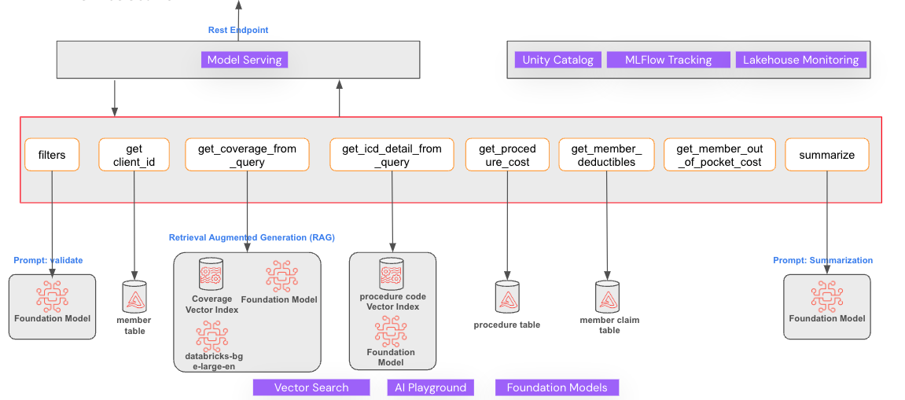
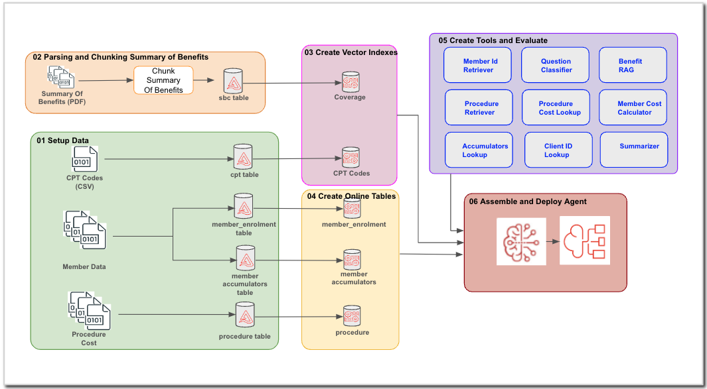

# CareCost-Compass

### Overview
Payers in the health care industry are organizations — such as health plan providers, Medicare, and Medicaid — that set service rates, collect payments, process claims, and pay provider claims. Eg: Cigna, United Health etc

When an individual need a service or care, most call the customer service representative of their payer on the phone and explain their situation to get an estimate of the cost of their treatment, service or procedure.

This calculation is pretty standard and can be done deterministically once we have enough information from the user. Creating an agentic application that is capable of identifying the relevant information from user input and then retrieving the right cost accurately can free up customer service agents to attend more important phone calls.

Care Cost Compass is a Gen AI application that
- gets natural language input from user (eg: What will be the cost of a shoulder MRI?)
- looks up user benefits
- looks up appropriate procedure code
- looks up procedure cost for the code
- looks up customer deductibles and other accumulators
- calculates the out of pocket cost for in-network and out-of-network
- summarizes the calculation and cost in simple english and present it to the user.

The application will showcase best practices and platform capabilities like vector search, custom pyfunc models, guard rails, online tables, llm evaluation and model serving

### Meet LemonDrop
Meet our (imaginary) payor, **LemonDrop**,who is a nationwide Health Insurance Provider and offers multiple health insurance products to customers via their employers.  Each employer being a client of **LemonDrop**

The Summary of Benefit document that describes the negotiated coverage and deductibles for each client is available in Unity Catalog volume. Data Ingestion workflows make sure these documents are kept up-to-date every plan year. The procedure cost is tracked by CPT code.

**LemonDrop** has negotiated rates for all covered procedures with most major Providers in the country. The negotiated rates are stored in Unity Catalog table and is preiodically refreshed using the data ingestion pipelines.

**LemonDrop** also tracks the member deductibles (accumulators) in a database table and that data is available in the Unity Catalog as well.

Currently **LemonDrop** has two clients; **SugarShack** and **ChillyStreet**. **SugarShack** and **ChillyStreet** is offering medical plans for their employees and each of them have different plans.

**LemonDrop** is developing this Compound Gen AI Agent application to answer customer questions related to cost of a procedure, so that customer service agents take care of more important calls that really needs manual attention.

### Workflow
A typical workflow for a procedure cost estimation is as below
- Understand the client_id of the customer who is asking the question
- Retrieve the appropriate negotiated benefit related to the question
- Retrieve the procedure code related to the question
- Retrieve the current member deductibles
- Retrieve the procedure cost for the procedure code
- With the benefit details, cost and current deductibles, calculate the in-network and out-of-network cost for the procedure for the member
- Summarize the cost calculation and present it to the user

In this project, we are attempting to create a Compound Gen AI application that perform these steps and derive the cost accurately. Many simplifying assumptions have been made in the sample data to keep the scope of this work limited to the design, development and deployment of the agentic application

### Architecture

### Build the Solution in Databricks Workspace
The given notebooks will build all the application components step-by-step. The whole process looks like this

To run this demo in a Databricks Workspace, follow the below steps
1. Use [Dabaricks Git Folders](https://docs.databricks.com/en/repos/index.html) and clone the repo into your workspace
2. Create a `single-node` cluster for running the notebooks. This code is tested on a `DBR 14.3LTS ML` cluster. 
3. Add `scripts/init_script.sh` to the cluster by following this [documentation](https://docs.databricks.com/en/init-scripts/cluster-scoped.html). 
4. Open the `utils/init` notebook and update the values in `Cmd 4` appropriately
5. Start by running notebooks `01 Setup Data` to `08_Building Evaluation Dataframe using Review App  Data` sequentially. Follow along the documentation in the notebooks

### Copyright/License Info
Copyright Databricks, Inc. [2024]. The source in this notebook is provided subject to the [Databricks License](https://databricks.com/db-license-source). 
All databricks packages used is subject to the [Databricks License](https://databricks.com/db-license-source). 
All included or referenced third party libraries are subject to the licenses set forth below.

| Library Name |Library License|Library License URL|
---------------|---------------|-------------------|
|opencv-python|MIT license|https://pypi.org/project/opencv-python/|
|camelot-py|MIT License|https://camelot-py.readthedocs.io/en/master/user/intro.html#camelot-license|
|pdfplumber|MIT License|https://github.com/jsvine/pdfplumber/blob/stable/LICENSE.txt|
|typing| Python Software Foundation License|https://github.com/python/typing/blob/main/LICENSE|
|MLflow| Apache License 2.0| https://github.com/mlflow/mlflow/blob/master/LICENSE.txt|
|LangChain| MIT License| https://github.com/langchain-ai/langchain/blob/master/LICENSE|

